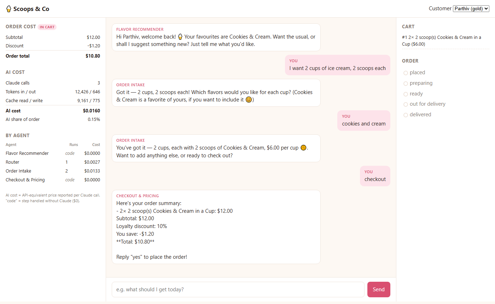
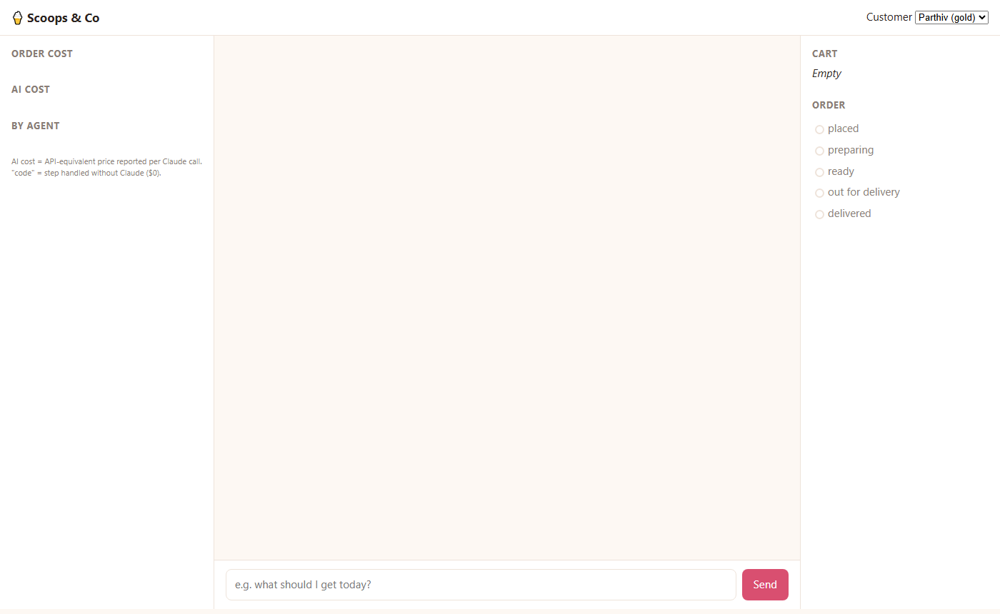
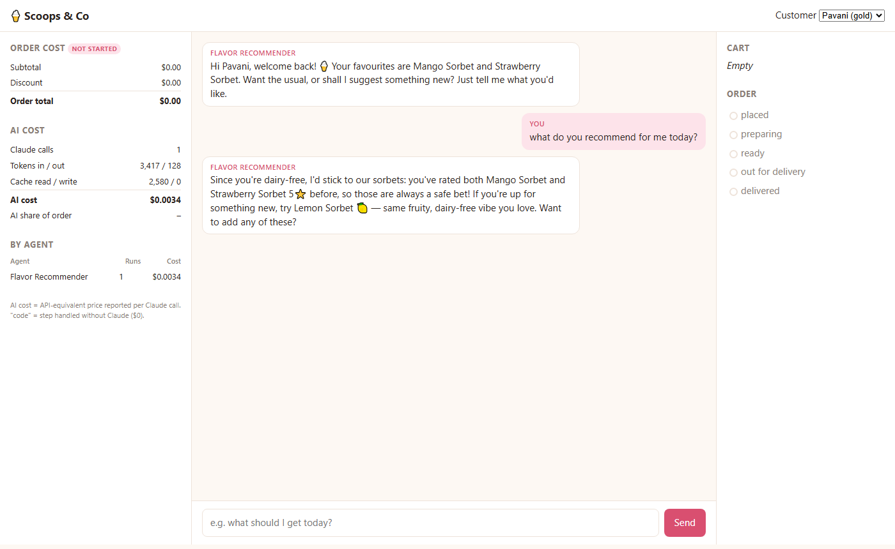
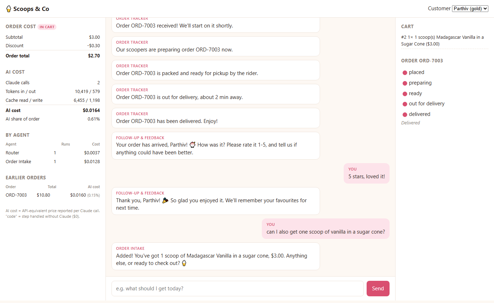

# Ice Cream Order Agentic Flow (POC)

A chat-based ice cream ordering assistant. Five cooperating Claude agents take the order,
suggest flavors, check out, send live delivery updates, and follow up after delivery.

## Agents

| # | Agent | What it does |
|---|---|---|
| 1 | **Order Intake** | Turns natural language into cart items; asks clarifying questions |
| 2 | **Flavor Recommender** | Suggests flavors from past orders + ratings + stock; best sellers for new customers |
| 3 | **Checkout & Pricing** | Stock check, loyalty/promo pricing, explicit confirmation, places the order |
| 4 | **Order Tracker** | Background status updates (PLACED → … → DELIVERED) pushed live; answers "where's my order?", cancels |
| 5 | **Follow-up & Feedback** | Auto-starts on delivery; collects rating, detects sentiment, offers coupon/remake; feeds ratings back to Agent 2 |

An orchestrator routes every customer message to one agent using a small Claude
structured-output call.

## Screenshots

The chat is in the middle. The left panel shows **order value vs AI cost**, live; the right
panel shows the cart and order progress. Open a specific customer with `http://localhost:8000/#pavani`.

**1. Order in progress:** Order Intake understood "2 cups, 2 scoops each"; the price summary
comes from code (no Claude call).


**2. Delivered:** live status updates, the rating request and a 5★ thank-you, with the final AI
cost at 0.15% of the order.


**3. Personalised and safe:** Pavani is dairy-free, so the recommender suggests only sorbets.
The whole prompt was read from the prompt cache (2,580 read / 0 written).


**4. Next order:** the new cart is costed separately; the finished order moves to
"Earlier orders".


## Run

```bash
python -m venv .venv
.venv\Scripts\activate            # Windows  (source .venv/bin/activate on macOS/Linux)
pip install -r requirements.txt
uvicorn app.main:app --reload
```

Two ways to power the agents (see `.env.example`):
- **Claude Code (default, no API key):** needs the [Claude Code](https://claude.com/claude-code) CLI
  installed and logged in. Each agent turn runs `claude -p` on your own subscription. For
  personal, local use only.
- **Claude API:** put `ANTHROPIC_API_KEY=...` in `.env` (pay-as-you-go). Setting a key switches
  the backend automatically.

📘 **New to agentic AI?** Read [learn.md](learn.md) for the architecture: patterns, models,
context engineering, MCP, speed and quality trade-offs.

💰 **AI cost per order:** [COST_TUNING.md](COST_TUNING.md) has before/after tables. Tuning took
it from $0.111 to about $0.02 per order.

Open http://localhost:8000 and pick a customer:
- **Parthiv** (gold): cookies & cream
- **Zarna** (silver): chocolate and vanilla
- **Dirgh**: Cookie Monster, cookies & cream milkshake
- **Pavani** (gold): strawberry and mango, dairy-free only
- **Jagrut** (silver): chocolate, cookies & cream
- **Aryan**: chocolate chip and banana sundae

Try: "what should I get?" → "2 scoops of the first one in a waffle cone" → "checkout with SUMMER10"
→ "yes" → watch the status updates → answer the feedback question.

Set `TRACKER_SPEED=0.3` in `.env` for a faster delivery demo.

## Tests

```bash
pytest                      # all tests; Claude is stubbed, no API key needed
pytest tests/test_store.py::test_promo_stacks_with_loyalty   # a single test
```

Data is in memory, seeded from `data/menu.json` and `data/customers.json`, and resets on restart.
